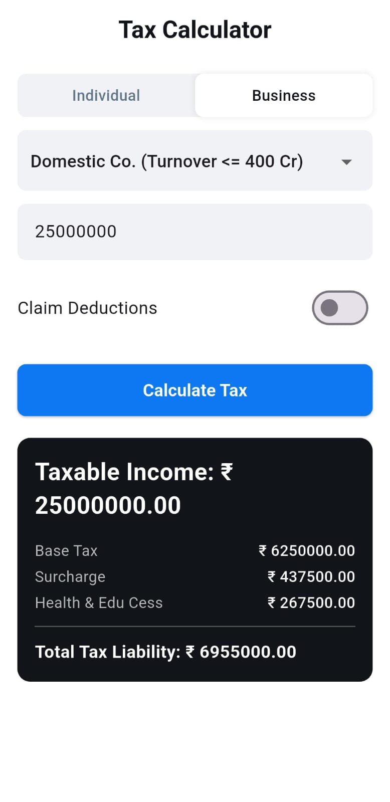
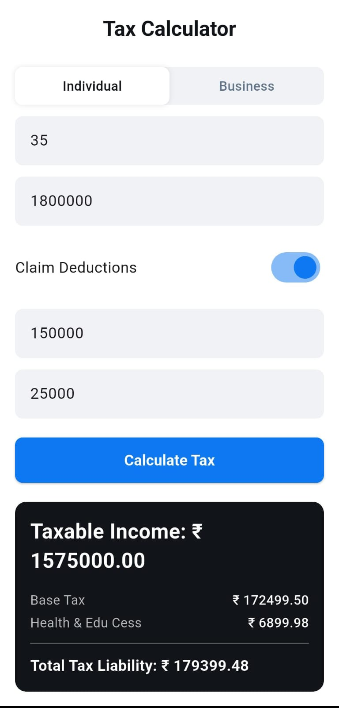

# ProTax - Flutter Tax Calculator 📱🇮🇳

A clean, modular Flutter application for calculating Indian income tax for both individuals and businesses. The app features a simple user interface and a decoupled backend logic layer for easy maintenance and updates.

## 🎯 Project Objective

The primary goal of ProTax is to provide a straightforward and accurate tax calculation tool on mobile. It serves two main user categories:

1.  **Individuals**: Calculates income tax based on the latest tax slabs, including handling of standard and user-claimed deductions.
2.  **Businesses**: Calculates corporate tax for various domestic and foreign company types, including partnerships, and correctly applies relevant surcharges.

The project emphasizes a clean, maintainable codebase by separating the UI (frontend) from the calculation logic (backend) within the same Flutter project.


## 📸 Screenshots

A glimpse of the ProTax user interface.

| Individual Calculator | Business Calculator |
| :---: | :---: |
|  |  |


## 📁 Project Structure

The project is organized into a modular structure within the `lib` folder to ensure a clean separation of concerns.

```
lib
├── backend/            # Contains all the core calculation logic and data
│   ├── backend.dart    # Public API/entry point for the backend
│   ├── src/
│   │   ├── calculators/  # Holds the specific tax calculation algorithms
│   │   ├── models/       # Data structures (Inputs, Results, Tax Data)
│   │   └── tax_calculator.dart # Main controller to delegate calculations
│   └── (pubspec files are removed as it's not a separate package)
│
├── main.dart           # Main entry point for the Flutter application
│
├── models/             # UI-specific models (e.g., Deduction class for controllers)
│
├── pages/              # Contains the main screen/page of the app
│   └── tax_calculator_page.dart
│
└── widgets/            # Reusable UI components for building the pages
    ├── common/         # Generic widgets like buttons and text fields
    └── (specific form, card, and section widgets)
```


## ⚙️ How It Works

The application's workflow is designed to be simple and robust, following a clear data flow from the user interface to the logic layer and back.

#### 1\. User Interface (Frontend)

  * The UI is built using Flutter and managed primarily within `lib/pages/tax_calculator_page.dart`.
  * This page uses a `StatefulWidget` to manage user inputs from text fields, a dropdown for business types, and toggle switches for deductions.
  * The UI is composed of smaller, reusable widgets from the `lib/widgets/` directory, such as `IndividualInputForm`, `BusinessInputForm`, and `ResultsCard`.

#### 2\. Data Gathering & Backend Call

  * When the user taps the **"Calculate Tax"** button, the `_performTaxCalculation` function is triggered.
  * This function reads the values from the `TextEditingController`s and state variables.
  * It creates a strongly-typed input object: either `IndividualInput` or `BusinessInput` (from `lib/backend/src/models/tax_inputs.dart`).
  * This input object is then passed to the backend's main `calculateTax()` function.

#### 3\. Calculation Logic (Backend)

  * The call is received by `lib/backend/src/tax_calculator.dart`, which acts as a router. It checks the type of the input object and delegates the task to the appropriate calculator in `lib/backend/src/calculators/`.
  * The raw tax data (slabs, rates, surcharge rules) is stored as Dart `List<Map>` in `lib/backend/src/models/tax_data.dart`, effectively replacing the need to parse CSV files at runtime.
  * The calculator performs the step-by-step calculations for base tax, surcharge, cess, and rebates.
  * Finally, it packages all the results into a `TaxResult` object (from `lib/backend/src/models/tax_result.dart`).

#### 4\. Displaying Results

  * The `TaxResult` object is returned to the UI layer.
  * The `_performTaxCalculation` function receives this result and updates the app's state using `setState()`.
  * This state change triggers a rebuild of the UI, and the `ResultsCard` widget appears, displaying the formatted data from the `TaxResult` object.

#### Data Flow Summary

```
[UI Input] -> [Input Object] -> calculateTax() -> [Calculator Logic] -> [TaxResult Object] -> [UI Update]
```


## ✅ Test Cases

To verify the app's correctness, you can use the following test cases.

#### Individual

  * **Input**: Age `35`, Income `₹1,800,000`, Deductions `₹175,000`
  * **Expected Total Tax**: `₹179,400.00`
  * **Reasoning**: After a total deduction of ₹225,000 (including the ₹50k standard deduction), the tax is calculated on ₹1,575,000 using slabs, with a 4% cess applied.

#### Business

  * **Input**: Type `Domestic Co. (Turnover <= 400 Cr)`, Revenue `₹25,000,000`
  * **Expected Total Tax**: `₹6,955,000.00`
  * **Reasoning**: A 25% base tax is applied, followed by a 7% surcharge on the tax amount (as income \> 1 Cr), and finally a 4% cess on the total of tax and surcharge.